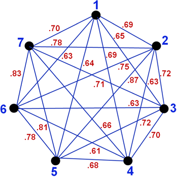

---
jupytext:
  text_representation:
    extension: .md
    format_name: myst
    format_version: 0.12
    jupytext_version: 1.9.1
kernelspec:
  display_name: Python 3
  language: python
  name: python3
---

# Sprectral Clustering

## Basics of clustering

Another useful application of the topics introduced in this chapter is a method called _spectral clustering_. Let's first define what a mean by clustering. Suppose we are given a dataset $n$ datapoints $D = \{\boldsymbol{x}_1,\dots, \boldsymbol{x}_n\} \subseteq \mathbb{R}^p$. Here each vector $\boldsymbol{x}_i$ corresponds to one observation, and contains $d$ features about this observation. For example, given a class with $n$ students, $\boldsymbol{x}_i$ could contain the homework grades of student $i$.

In clustering, we want to partition the dataset $D$ into $K$ subsets $C_1,\dots, C_K$ that add up to the entire set $D$. Think about this as grouping each student into one of $K$ distinct groups based on their grades. One very simple and classical example of an algorithm for this type of clustering is called $K$-means, and roughly it works as follows:

1. Randomly assign the datapoints $\boldsymbol{x}_1,\dots, \boldsymbol{x}_n$ to $K$ clusters $C_1,\dots,C_K$
2. Compute the mean of each cluster $\boldsymbol{\mu}_j = \frac{1}{|C_j|}\sum_{\boldsymbol{x}_i \in C_j}\boldsymbol{x}_i$
3. Reassign each point $\boldsymbol{x}_i$ to the cluster whose mean it is closest too
4. Repeat steps 2 and 3 until the clusters stop updating

Despite its simplicity, the $K$-means clustering algorithm is suprisingly effective, especially for relatively simple problems. However, basic $K$-means begins to perform worse when we move to higher dimensions -- i.e. when the number of features $p$ and samples $n$ grows large. In this situation, we often want a method that utilizes some type of dimension reduction. This is where the singular value decomposition and/or eigenvalue decomposition becomes an important tool. In the next subsection, we discuss one such method that uses the EVD to make clustering easier in high dimensions.

## Spectral Clustering

Let us now see how we can use the various eigen/singular-value decompositions to define an improved clustering method in high dimensions. In spectral clustering, we typically think of datapoints as being arranged as nodes on a _graph_. A graph is simply a mathematical structure containing a set of nodes and a set of edges connecting different nodes. In a _weighted graph_, each edge is associated with a weight corresponding to "how connected" points are to each other. For example, see the figure below illustrated a weighted graph.

In our context, we think of each node as being an observation $\boldsymbol{x}_i$, and the weight between observation $\boldsymbol{x}_i$ and observation $\boldsymbol{x}_j$ as being some measure of how similar the datapoints are. Thus we require some similarity measure $\mathsf{sim}(\boldsymbol{x},\boldsymbol{x}').$

A few common examples used in practice would be the absolute-cosine similarity $\mathsf{sim}(\boldsymbol{x},\boldsymbol{x}') = \frac{\boldsymbol{|x^\top x'|}}{\|\boldsymbol{x}\|_2\|\boldsymbol{x}'\|_2}$, or the so-called Gaussian RBF kernel $\mathsf{sim}(\boldsymbol{x},\boldsymbol{x}') = \exp(-\gamma \|\boldsymbol{x}-\boldsymbol{x}'\|_2)$, where $\gamma$ is a hyperparameter that we can choose as the user. Both of these metrics are larger for more "similar" datapoints, and smaller for more dissimilar points. The graph representing the dataset is completely described by the $n\times n$ similarity matrix $\boldsymbol{S}$ where

$$
\boldsymbol{S}_{ij} = \mathsf{sim}(\boldsymbol{x}_i,\boldsymbol{s}_j).
$$

Typically we assume that $\mathsf{sim}(\boldsymbol{x},\boldsymbol{x}') = \mathsf{sim}(\boldsymbol{x}',\boldsymbol{x})$ so that the matrix $\boldsymbol{S}$ is symmetric.

Next, it is common practice to normalize this matrix in a few ways. First, we define a diagonal matrix $\boldsymbol{D} = \text{diag}(d_1,\dots, d_n)$ where

$$
d_i = \sum_{j=1}^n \boldsymbol{S}_{ij}
$$

i.e. the total amount of similarity between $\boldsymbol{x}_i$ and the rest of the datapoints. Next, we use this to normalize the similarity matrix to obtain

$$
\widetilde{\boldsymbol{S}} = \boldsymbol{D}^{-1/2}\boldsymbol{S}\boldsymbol{D}^{-1/2}.
$$

This really amounts to dividing each row/column $i$ of the similarity matrix $\boldsymbol{S}$ by it's total "output" of similarity, so that they are on a consistent scale. Note that $\widetilde{\boldsymbol{S}}$ will also be a symmetric matrix, and therefore it has a unique eigenvalue decomposition $\boldsymbol{\boldsymbol{S}} = \boldsymbol{V\Lambda V}^\top$. Similar to PCA, the eigenvectors of the matrix $\widetilde{\boldsymbol{S}}$ have an interpretation: the eigenvector $\boldsymbol{v}_j \in \mathbb{R}^n$ assigns a value to each datapoint $i \in \{1,\dots, n\}$, and these values will be close for points that a similar. Hence the spectral clustering algorithm in general works as follows:

1. Compute the normalized similarity matrix $\widetilde{\boldsymbol{S}}$
2. Compute eigenvalue decomposition $\widetilde{\boldsymbol{S}} = \boldsymbol{V\Lambda V}^\top$
3. Construct $n\times K$ matrix $\boldsymbol{V}_K = \begin{bmatrix} \boldsymbol{v}_1 & \dots & \boldsymbol{v}_K\end{bmatrix}$ containing the top $K$ eigenvectors
4. Perform $K$-means clustering using the rows of $\boldsymbol{V}_K$ as the observations

<!-- ## An example with image segmentation

One application of spectral clustering is to t -->
